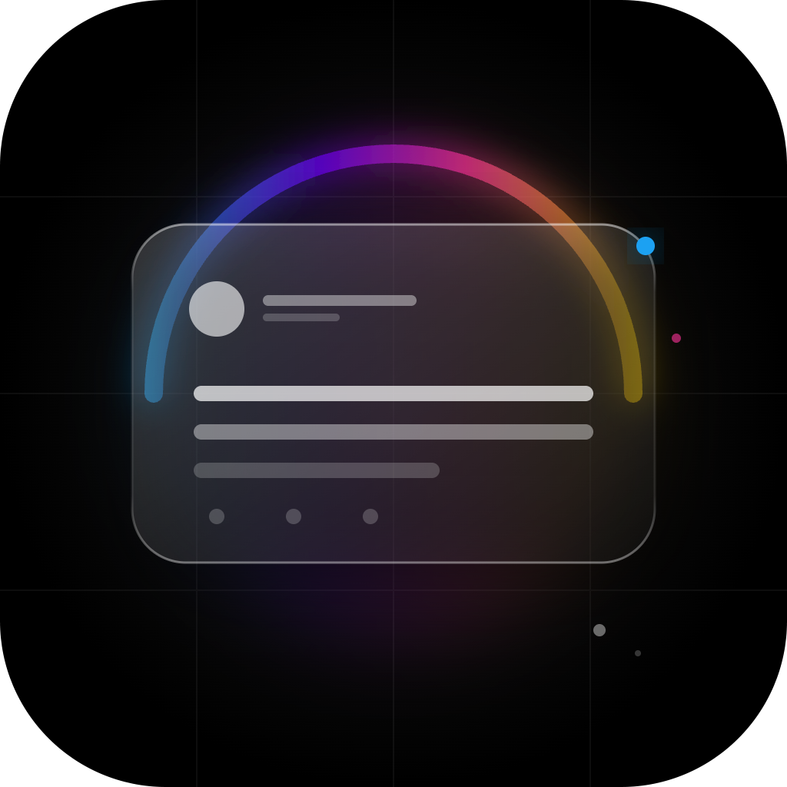

<div align="center">
  
  <h1>xCard - Beautiful Tweet Screenshots</h1>
  <p>Create stunning shareable images of X (Twitter) posts with customizable backgrounds, glassmorphism effects, and more.</p>
</div>

## Features

- **Beautiful Themes**: Light, Dark, and Glassmorphic glass cards.
- **Custom Backgrounds**: Choose from 20+ premium gradients (Midnight Bloom, Nordic Sky, etc.) or solid colors.
- **Smart Export**:
  - **High Quality**: 2x pixel ratio export.
  - **Glass Blur**: True "Double Capture" technology for authentic frosted glass effects.
  - **Transparent Mode**: Export just the card without background.
- **Internationalization**: Fully localized for English, Chinese (Simplified/Traditional), Spanish, Portuguese, and Italian.
- **Native Sync**: UI adapts to X.com's theme (Light/Dim/Dark).

## Installation

1. Clone repo
2. `pnpm install`
3. `pnpm dev`
4. Load unpacked extension in Chrome from `dist/`

## Build for Release

```bash
# Auto-package for release
bash release.sh
```
